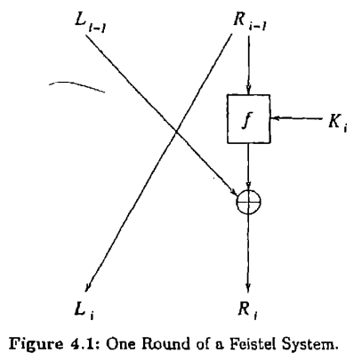

# DES (The Data Encryption Standard)

The DES was developed in the early 70s at IBM and was submitted to the National
Bureau of Standards, NBS (later the National Institute of Standards and
Technology, NIST) after they put out a public request for a new cryptographic
algorithm. It was forwarded to the National Security Agency (NSA) where, after
some modifications, it essentially became the DES algorithm we know today.

While the DES was used extensively, eventually, attacks on the system were
exposed. In 1990, Eli Biham and Adi Shamir demonstrated how their method of
differential cryptanalysis could be used to attack it. (we have an
implementation of a version of differential cryptanalysis in this module)

Today, there exist brute force attacks that can bring down DES. It is now
considered insecure for many applications and the algorithm has been withdrawn
as a standard by NIST.

## Simplified DES

The DES is a little difficult to encompass at first go, and presenting a
simplified version is a good way to ease into it. The algorithm is best
explained by simple diagrams.

The simplified DES takes a 12 bit message written in the form
L0R0 (L0 consists of the first 6 bits and
R0 consists of the last 6). The key K has 9 bits

  

The ith round of the algorithm has the following output:
<code>Li = Ri-1</code> and
<code>Ri = Li-1 XOR f(Ri-1, Ki)</code>
The output of one round becomes the input of the next.

The f function from the image and the relation looks like this:

  

E is the Expander function that transforms the 6-bit R into an 8-bit value.

S1 and S2 are called S-boxes. They take a 4-bit input and produce a 3-bit output

## Differential Cryptanalysis

Differential cryptanalysis is a method of attacking the DES. It was introduced
by Biham and Shamir around 1990. The high-level idea of the attack is pick
plaintexts and compare the difference in the ciphertexts received thereby
deducing information of the key.

The following is a summary of the procedure:
 1. Find the list of pairs where the input XOR = E(L'4) and the
 output XOR = R'4 XOR L'1
 2. The pair (E(L4) XOR K4,
 E(L*4) XOR K4) is on this list.
 3. Deduce the possibilities for K4
 4. Repeat until only one possibility for K4 remains.

## DES

The DES is a block cipher - it breaks plaintext into blocks of 64 bits and
encrypts blocks separately. The mechanics behind how this is done is called a
Feistel system (named after a member on the IBM team that developed the early
version of DES)

The components of DES can be well understood by understanding the simplified
DES. There are a few additional components (a lot of permutation functions) but
other than that, the implementation is easy to understand.

A fantastic resource for understanding the ins-and-outs of the implementation
was created by J. Orlin Grabbe and can be accessed at
[The DES Algorithm Illustrated](http://page.math.tu-berlin.de/~kant/teaching/hess/krypto-ws2006/des.htm).
It does a much better job of explaining the algorithm than I can do here.

## References
 - Trappe, Wade, and Lawrence C. Washington. Introduction to Cryptography: with
   Coding Theory. Pearson Prentice Hall, 2006.