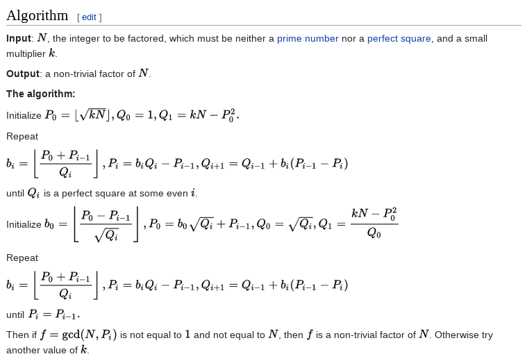

# RSA
(Messing aroung with two large primes p & q)

## The RSA Algorithm

### Introduction

The RSA algorithm was created after the proposal of the public key cryptosystem
as detailed by Diffie and Hellman 1976. However, they did not actually present
a practical implementation. That's where Rivest, Shamir, and Adleman come in. In
1977, they proposed the now famous RSA algorithm

### Cryptosystem
1. Bob chooses two distinct, large primes **p** and **q** and computes
    `n = pq`
2. Bob chooses **e** with `gcd(e, (p - 1)(q - 1)) = 1`
3. Bob computes **d** with `de = 1 (mod (p - 1)(q - 1))`
4. Bob makes **n** and **e** public, and keeps **p, q, d** secret.
5. Alice encrypts **m** as <code>c = me (mod n)</code>
6. Bob decrypts by computing <code>m = cd (mod n)</code>

## Shanks' Square Forms Factorization

Shanks' square forms factorization is a method for integer factorization is an
improvement on Fermat's factorization method.

The algorithm I used for this section can be found on Wikipedia and is as
follows:

## Sieve of Sundaram

The Sieve of Sundaram is an algorithm to find all prime numbers up to a
specified integer. The algorithm starts with a list of integers from 1 to n.
From this list, all numbers of the form i + j + 2ij are removed where
- i, j ∈ N, 1 <= i <= j
- i+ j + 2ij <= n

To generate a list of the odd prime numbers below 2n + 2, the remaining numbers
are doubled and incremented by one (this is where the Sieve of Sundaram does the
work that Eratosthenes does crossing each multiple of 2)

## References
 - Trappe, Wade, and Lawrence C. Washington. Introduction to Cryptography: with
   Coding Theory. Pearson Prentice Hall, 2006.